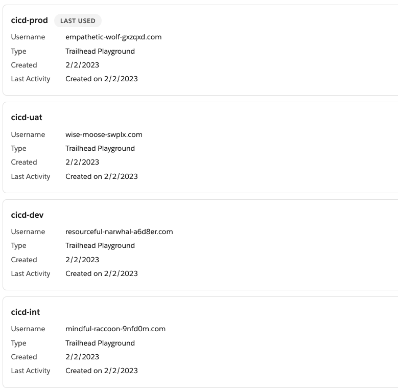
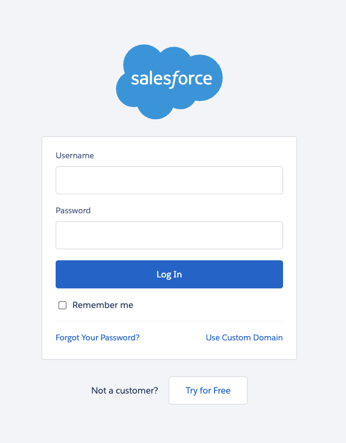

# Salto CI/CD Course: SFDX Project Template

This repo contains the sample sfdx project and metadata that we recommend using when following [Salto's CICD Course](www.salto.io).

## Installing the source code in trailhead playground orgs

It is **highly** recommended that you install this project and follow the course using 4 trailhead playground orgs, which will represent the 4 environments in a typical CI/CD pipeline:

- Your dev sandbox
- Integration sandbox
- UAT sandbox
- Production

Some commands in VSCode behave differently depending on whether you are connected to a scratch org, sandbox or trailhead playground. 

The course was tested with trailhead playgrounds so again, it's **highly** recommended that you do the same.

### Create 4 trailhead playgrounds

Go to your [trailhead account](https://trailhead.salesforce.com/) and create 4 playgrounds. 

Follow [these steps](https://trailhead.salesforce.com/content/learn/modules/trailhead_playground_management/get-your-trailhead-playground-username-and-password) to reset the password in all 4 playgrounds.

I recommend changing the name of your playgrounds to match the type of sandbox it's meant to represent, for example:



### Deploy the source code to all 4 trailhead playgrounds

Create a directory in your computer and clone this repo

```
git clone https://github.com/salto-io/salesforce-cicd-template
cd salesforce-cicd-template
```

Run the following command **4 times** to authorise sfdx to connect to all your playgrounds and provide an alias (see the `--setalias` flag).

I recommend that the aliases match the names you used in the previous step, where you renamed your playgrounds. For example:

```
sfdx auth:web:login -s --setalias cicd-dev-sandbox
```

```
sfdx auth:web:login -s --setalias cicd-integration-sandbox
```

```
sfdx auth:web:login -s --setalias cicd-uat-sandbox
```

```
sfdx auth:web:login -s --setalias cicd-prod
```

Each time you run the command, you'll be asked to log in to Salesforce. 




Make sure each time you log in to a **different** trailhead playground.

Then, set the default username of the sfdx project for each org, and deploy the code, for example:

```
sfdx config set defaultusername=cicd-dev-sandbox
sfdx force:source:deploy -p force-app
```

```
sfdx config set defaultusername=cicd-integration-sandbox
sfdx force:source:deploy -p force-app
```

```
sfdx config set defaultusername=cicd-uat-sandbox
sfdx force:source:deploy -p force-app
```

```
sfdx config set defaultusername=cicd-prod
sfdx force:source:deploy -p force-app
```

After this, the exact same code should be deployed to all your orgs!

## Reset Git

Because you cloned this repository, your local version of it its still tied to this remote. 

We need to remove this relationship so that we can start with Git from scratch later in the course.

From **within** the folder `salesforce-cicd-template`, run the following command:

In linux/mac

`sudo rm -rf .git`

In Windows

`rm -rf .git` or `rm -Force .git`

## Starting the course

You can now set the "dev sandbox" as default, as this is what we'll use to start the course.

```
sfdx config set defaultusername=cicd-dev-sandbox
```


